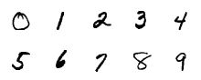
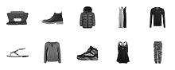
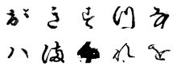
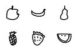
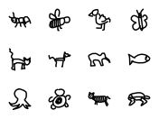
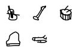

# {{ page.title }}

As part of this homework, you will write a client program that classifies images. The goal of this homework is to familiarize you with programming in Java. You will practice:

- Applying object-oriented programming concepts
- Making predictions using machine learning

## Instructions

### Task 1: Reading

- Read Algorithms, chapter 1.2, "Data Abstraction" to learn the basics of object-oriented programming
- Refer to the [Picture](https://introcs.cs.princeton.edu/java/11cheatsheet/#Picture) and [Color](https://introcs.cs.princeton.edu/java/11cheatsheet/#Color) cheatsheets. The full APIs are also linked from the cheatsheets.
- Read the information about machine learning below.

#### Background 

Classification is one of the central problems in *machine learning (ML)*, a discipline that is transforming 21st century computing. As a familiar example, consider the problem of classifying handwritten digits using [this web application](https://www.snaplogic.com/machine-learning-showcase/handwritten-digit-recognition):



Machine learning algorithms like this are widely used to classify handwritten digits (e.g., to recognize postal ZIP codes, process bank checks, and parse income tax forms).

The full power of machine learning derives from its amazing versatility. Machine learning algorithms rely upon data to learn to make predictions, without being explicitly programmed for the task. For example, the same code you will write to classify handwritten digits extends to classifying other types of images, simply by training the algorithm with different data.

Moreover, machine learning techniques apply not only to images but also to numerical, text, audio, and video data. Modern applications of ML span science, engineering, and commerce: from autonomous vehicles, medical diagnostics, and video surveillance to product recommendations, voice recognition, and language translation.

#### Approach

To classify images, we will use a **supervised learning** algorithm. Supervised learning is divided into two phases -- **training** and **testing**.

##### Training

In the training phase, the algorithm learns a function that maps an input to an output (or a label) using training data consisting of known input-output pairs. For the handwritten digit application, the training data comprise 60,000 grayscale images (inputs) and associated digits (labels). Here is a small subset:



In a **multiclass classification problem**, we seek to classify images into one of $$m$$ classes, labeled $$0, 1, \ldots, m - 1$$. For our handwritten digit application, there are $$m = 10$$ classes, with class $$i$$ corresponding to digit $$i$$.

##### Testing

In the testing phase, the algorithm uses the learned function to predict labels for unseen inputs.



Typically, the algorithm makes some prediction errors (e.g., predicts 9 when the handwritten digit is 6). An important quality metric is the **test error rate** -- the fraction of testing inputs that the algorithm misclassifies. It measures how well the learning algorithm generalizes from the training data to new data.

### Task 2: Download Project Files

This is an **individual** assignment.

Start by downloading [classify.zip](classify.zip), which contains the IntelliJ starter project. It is ~300MB, so it will take some time to download.

### Task 3: Implement ImageClassifier.java

#### Overview

- For this assignment, we provide a ML library -- `MultiPerceptron` -- for classifying vectors of `n` real numbers into one of `m` classes. In a future assignment, you will implement this ML library using perceptrons.
- For this assignment, your task is to write an image classifier client, named `ImageClassifier.java`, that classifies images using the `MultiPerceptron` data type we provide.
- Note that you will **not** implement `MultiPerceptron.java` until a future assignment. The focus of this assignment is on **using** data types, whereas the focus of Part 2 is on **creating** data types. For now, you must use the pre-compiled `MultiPerceptron.class` that is included in the project folder.
- You should comment all instance variables, explaining their purposes.
- Your code must conform to the stated API. Violations include:
  - Adding public methods. You are free to add private methods (which are accessible only in the class in which they are declared).
  - Producing undocumented side effects, such as reading from standard input in `main()` or altering the `Picture` argument to `extractFeatures.` See the `ImageClassifier` API below.

#### MultiPerceptron Data Type

This ML library is widely applicable: you can use it not only to classify images but also to classify numerical, text, and audio data. The main idea is to extract features from the data, representing each training and testing input as a vector $$x = x_0, x_1, \ldots, x_{n-1}$$ of $$n$$ real numbers. For our handwritten digit application, each input is a 28-by-28 grayscale image and the features are the $$n = 28 \times 28 = 784$$ grayscale values that constitute the image.

Here is the MultiPerceptron API that you will use:

```
public class MultiPerceptron

    // Creates a multi-perceptron object with m classes
    // and size of the feature vector n.
    public MultiPerceptron(int m, int n)

    // Returns the number of classes m.
    public int numberOfClasses()
    
    // Returns the number of inputs n, the size of the feature vector
    public int numberOfInputs()
    
    // Returns the predicted label for the given input.
    public int predictMulti(double[] x)

    // Trains this multi-perceptron on the labeled input.
    public void trainMulti(double[] x, int label)
```

#### ImageClassifier.java client

Your task is to write a client program `ImageClassifier.java` that classifies images using the `MultiPerceptron` data type described in the previous section by:
- Training it using the input-output pairs specified in a training data file.
- Testing the predictions using the input-output pairs specified in a testing data file.
- Printing a list of misclassified images and the test error rate.

Organize your client according to the following API:

```
public class ImageClassifier

    // Creates a feature vector (1D array) from the given picture.
    // See below for more details.
    public static double[] extractFeatures(Picture picture)

    // See below.
    public static void main(String[] args)
```

##### extractFeatures()

The `extractFeatures()` method converts a grayscale image into a one-dimensional array suitable for use with the `MultiPerceptron` data type. This method must perform two conversions:

1. Convert the width-by-height image into a width-by-height matrix of grayscale values. Recall that a shade of gray has its red, green, and blue components all equal.
2. Convert the width-by-height matrix of grayscale values into a one-dimensional array of length width $$\times$$ height by iterating over the matrix elements in row-major order.



##### main()

The `main()` method takes two command-line arguments:
1. The name of a file that contains the training data.
2. The name of a file that contains the testing data.

`main()` should:

1. Create a `MultiPerceptron` object with `m` classes and `n = width * height` inputs.
2. Train the `MultiPerceptron` object using the images and labels from the training data file.
3. Use the trained `MultiPerceptron` object to classify the images from the testing data file, producing as output the following information:
  - A list of misclassified images, one per line.
  - The test error rate (the fraction of test images that the algorithm misclassified).

Here are some sample executions:
```
> java-introcs ImageClassifier digits-training20.txt digits-testing10.txt 
digits/testing/1/46.png
digits/testing/7/36.png
digits/testing/7/80.png
digits/testing/1/40.png
digits/testing/1/39.png
digits/testing/7/79.png
digits/testing/9/20.png
digits/testing/9/58.png
test error rate = 0.8

> java-introcs ImageClassifier digits-training60K.txt digits-testing10K.txt 
jar:file:digits.jar!/testing/5/9428.png
jar:file:digits.jar!/testing/6/4814.png
jar:file:digits.jar!/testing/5/4915.png
...
jar:file:digits.jar!/testing/5/7870.png
jar:file:digits.jar!/testing/4/1751.png
jar:file:digits.jar!/testing/5/6043.png
test error rate = 0.136

> java-introcs ImageClassifier fashion-training60K.txt fashion-testing10K.txt 
...

> java-introcs ImageClassifier Kuzushiji-training60K.txt Kuzushiji-testing10K.txt
...

> java-introcs ImageClassifier fruit-training30K.txt fruit-testing6K.txt
...

> java-introcs ImageClassifier animals-training60K.txt animals-testing12K.txt
...

> java-introcs ImageClassifier music-training50K.txt music-testing10K.txt
...
```

**Note:**
Dont worry about the odd looking filenames. It's just a verbose way to specify the location to a specific image file in a JAR (Java ARchive) file. Modern operating systems are not so adept at manipulating hundreds of thousands of individual image files, so this makes training more efficient. For example, consider `jar:file:digits.jar!/testing/5/9428.png`. In this case, `jar:file:digits.jar` identifies the JAR file `digits.jar` and `/training/5/9428.png` identifies a file named `9428.png`, which is located in the subdirectory `/training/5/` of the JAR file.

#### Input Files 

A training data file consists of a sequence of lines:
- The first line contains the number of classes `m`
- The second line contains the `width` and `height`, respectively, of the images
- Each remaining line contains the name of an image file (e.g., corresponding to a handwritten digit) followed by an integer label (e.g., identifying the correct digit), separated by whitespace.

The file format for testing data files is the same, but you will use the integer labels in the testing data files only to check the accuracy of your predictions.



We provide a variety of sample input files in the specified format, including handwritten digits, fashion articles from Zalando, Hirigana characters, and doodles of fruit, animals, and musical instruments.

<table>
<tr>
  <th>Data files</th>
  <th>Description</th>
  <th>Examples</th>
  <th>Source</th>
</tr>
<tr>
  <td>digits.jar<br>
    digits-training60K.txt<br>
    digits-testing10K.txt
  </td>
  <td>Handwritten digits</td>
  <td></td>
  <td><a href="http://yann.lecun.com/exdb/mnist/">MNIST</a></td>
</tr>
<tr>
  <td>fashion.jar<br>
    fashion-training60K.txt<br>
    fashion-testing10K.txt
  </td>
  <td>Fashion articles</td>
  <td></td>
  <td><a href="https://github.com/zalandoresearch/fashion-mnist">Fashion MNIST</a></td>
</tr>
<tr>
  <td>Kuzushiji.jar<br>
    Kuzushiji-training60K.txt<br>
    Kuzushiji-testing10K.txt
  </td>
  <td>Hirigana characters</td>
  <td></td>
  <td><a href="https://github.com/rois-codh/kmnist">Kuzushiji MNIST</a></td>
</tr>
<tr>
  <td>fruit.jar<br>
    fruit-training30K.txt<br>
    fruit-testing6K.txt
  </td>
  <td>Fruit doodles</td>
  <td></td>
  <td><a href="https://quickdraw.withgoogle.com/data">Quick, Draw!</a></td>
</tr>
<tr>
  <td>animals.jar<br>
    animals-training60K.txt<br>
    animals-testing12K.txt
  </td>
  <td>Animal doodles</td>
  <td></td>
  <td><a href="https://quickdraw.withgoogle.com/data">Quick, Draw!</a></td>
</tr>
<tr>
  <td>music.jar<br>
    music-training50K.txt<br>
    music-testing10K.txt
  </td>
  <td>Musical instrument doodles</td>
  <td></td>
  <td><a href="https://quickdraw.withgoogle.com/data">Quick, Draw!</a></td>
</tr>
</table>


#### Hints

These are purely suggestions for how you might make progress. You do not have to follow these steps. If you get stumped or frustrated on some portion of the assignment, please contact the instructor or TAs for help.

##### Parsing Input Files

- Review the ["In" data type](https://introcs.cs.princeton.edu/java/11cheatsheet/#In), which is an object-oriented version of `StdIn`. You need the object-oriented version in this program since you will be reading from two different files in the same program.
  - Create an `In` object for the training file`digits-training20.txt`. Read the
integers `m`, `width`, and`height`, and print them to standard output. Read pairs of filenames (strings) and labels (integers) and print them to standard output.
  - Do the same for the testing file `digits-testing10.txt`.
- Modify your program to take the names of the testing and training files as
command-line arguments.
- Review the ["Picture" data type](https://introcs.cs.princeton.edu/java/11cheatsheet/#Picture). For each image, create a new `Picture` object and display in its own window. Note that the image displays may overlap!

##### Feature Extraction

- Review the ["Picture"](https://introcs.cs.princeton.edu/java/11cheatsheet/#Picture) and ["Color"](https://introcs.cs.princeton.edu/java/11cheatsheet/#Color) data types, as well as the [Grayscale.java](https://introcs.cs.princeton.edu/31datatype/Grayscale.java.html) and [Luminance.java](https://introcs.cs.princeton.edu/java/31datatype/Luminance.java.html) example programs. Note that the images **are already grayscale**, so you dont need to perform any fancy calculations -- since, the red, green, and blue components are equal, you can use any of `getRed()`, `getGreen()`, or `getBlue()` to get the grayscale value.
- Create a `Picture` object for the image `49785.png` (located in the project folder) and display it in a window. (Remove or comment out this code after you have successfully displayed the image.)
- Create a `Picture` object for the image `image3-by-3.png` (located in the project folder) corresponding to the 3-by-3 example given below. Extract its width and height and print the values to standard output. Then, extract the grayscale values of the pixels and print. If its not already in row-major order, adjust your code so that it prints the values in the specified order.



- Create a one-dimensional array of length widthheight and copy the grayscale values to the array. Print the values of this array to confirm you can create a vector (row-major order) of values from a `Picture`object.
- Using this code you should be ready to implement the static method `extractFeatures()` that takes a `Picture` as an argument and returns the grayscale values as a `double[]` in row-major order.
- Finally, write a `main()` method that tests `extractFeatures()`.

**Note:**
If you are using IntelliJ, do not type the`import java.awt.Color;` statement that is normally needed to access Javas color data type. IntelliJ is pre-configured to automatically add import statements when needed (and remove them when not needed).

##### Classifying Images

- **Classifier**: After reading `m`, `width`, and `height` from the training file, create a `MultiPerceptron` object of the correct dimensions.
- **Training**: For each training image, train the classifier using the corresponding label.
- **Testing:** For each testing image, predict its class. Print each misclassified image to standard output and tabulate statistics on the number of misclassified images.
- **Error rate**: After training and testing, print the error rate to standard output in the specified format.
- **Small Test**: Test your program on some small data files, such as `digits-training20.txt` and `digits-testing10.txt`
- **Big Test**: Now, the fun part. Use large training and testing input files, such as `digits-training60K.txt` and `digits-testing10K.txt`. Be prepared to wait for 1 minute (or more) while your program processes 60,000 images.


### Task 4: Analysis

Some people (especially in Europe and Latin America) write a 7 with a line through the middle, while others (especially in Japan and Korea) make the top line crooked:





Suppose that the training data consists solely of samples that do not use any of these conventions. How well do you think the algorithm will perform when you test it on different populations? What are the possible consequences?

Now suppose that you are using a supervised learning algorithm to diagnose cancer. Suppose the training data consists of examples solely on individuals from population X but you use it on individuals from population Y. What are the possible consequences?

Provide your answers in your `readme.txt` file.

## Submit

Upload the following files to **Gradescope**:

* ImageClassifier.java
* **A completed readme.txt file,** including your analysis, etc.

## Acknowledgements

Thanks to Princeton's COS126 materials, which served as a basis for this assignment.
